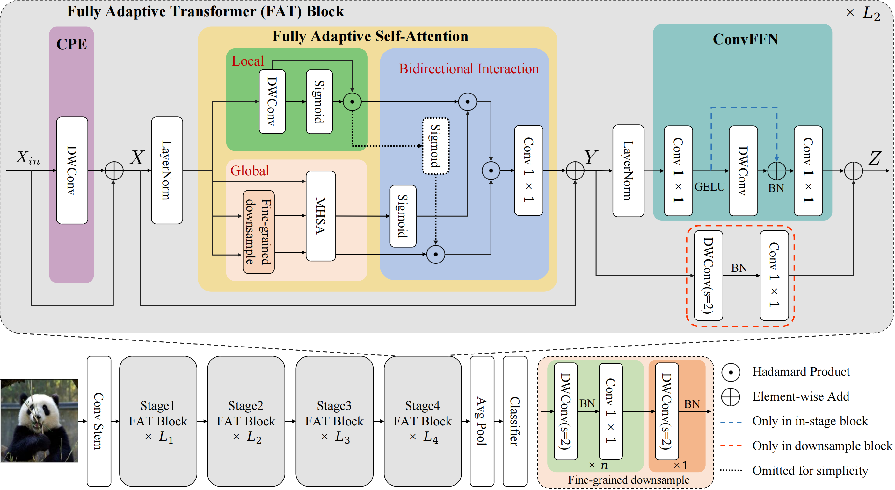

# Lightweight Vision Transformer with Bidirectional Interaction

Official code of "Lightweight Vision Transformer with Bidirectional Interaction"

[Arxiv](https://arxiv.org/abs/2306.00396)

Abstract: Recent advancements in vision backbones have significantly improved their performance by simultaneously modeling images’ local and global contexts. However, the bidirectional interaction between these two contexts has not been well explored and exploited, which is important in the human visual system. This paper proposes a **F**ully **A**daptive **S**elf-**A**ttention (FASA) mechanism for vision transformer to model the local and global information as well as the bidirectional interaction between them in context-aware ways. Specifically, FASA employs self-modulated convolutions to adaptively extract local representation while utilizing self-attention in down-sampled space to extract global representation. Subsequently, it conducts a bidirectional adaptation process between local and global representation to model their interaction. In addition, we introduce a fine-grained downsampling strategy to enhance the down-sampled self-attention mechanism for finer-grained global perception capability. Based on FASA, we develop a family of lightweight vision backbones, **F**ully **A**daptive **T**ransformer (FAT) family. Extensive experiments on multiple vision tasks demonstrate that FAT achieves impressive performance. Notably, FAT accomplishes a **77.6%** accuracy on ImageNet-1K using only **4.5M** parameters and **0.7G** FLOPs, which surpasses the most advanced ConvNets and Transformers with similar model size and computational costs. Moreover, our model exhibits faster speed on modern GPU compared to other models.

## Requirements

- Linux with Python ≥ 3.6
- PyTorch >= 1.8.1
- timm >= 0.3.2
- CUDA 11.3


### Conda environment setup

**Note**: Our environmemt is the same with [LITv2](https://github.com/ziplab/LITv2)

```bash
conda create -n fat python=3.7
conda activate fat
#Install Pytorch and TorchVision
pip install torch==1.8.1+cu113 torchvision==0.9.1+cu113 torchaudio==0.8.1 -f https://download.pytorch.org/whl/torch_stable.html

pip install timm
pip install ninja
pip install tensorboard

# Install NVIDIA apex
git clone https://github.com/NVIDIA/apex
cd apex
pip install -v --disable-pip-version-check --no-cache-dir --global-option="--cpp_ext" --global-option="--cuda_ext" ./
cd ../
rm -rf apex/

pip install opencv-python==4.4.0.46 termcolor==1.1.0 yacs==0.1.8

gh repo clone DingXiaoH/RepLKNet-pytorch
unzip cutlass.zip
cd examples/19_large_depthwise_conv2d_torch_extension
./setup.py install --user
export LARGE_KERNEL_CONV_IMPL=WHERE_YOU_CLONED_CUTLASS/examples/19_large_depthwise_conv2d_torch_extension
```
more details can be found in ```classification```, ```detection``` and ```segmentation```

## Acknowledgement

Our code is built upon [DeiT](https://github.com/facebookresearch/deit), [Swin](https://github.com/microsoft/Swin-Transformer), [LIT](https://github.com/ziplab/LIT), [LITv2](https://github.com/ziplab/LITv2) and [RepLKNet](https://github.com/MegEngine/RepLKNet), we thank the authors for their open-sourced code.

## Citation

If you use FAT in your research, please consider the following BibTeX entry and giving us a star:
```BibTeX
@inproceedings{fan2023fat,
  title={Lightweight Vision Transformer with Bidirectional Interaction},
  author={Fan, Qihang and Huang, Huaibo and Zhou, Xiaoqiang and He, Ran},
  booktitle={NeurIPS},
  year={2023}
}
```
